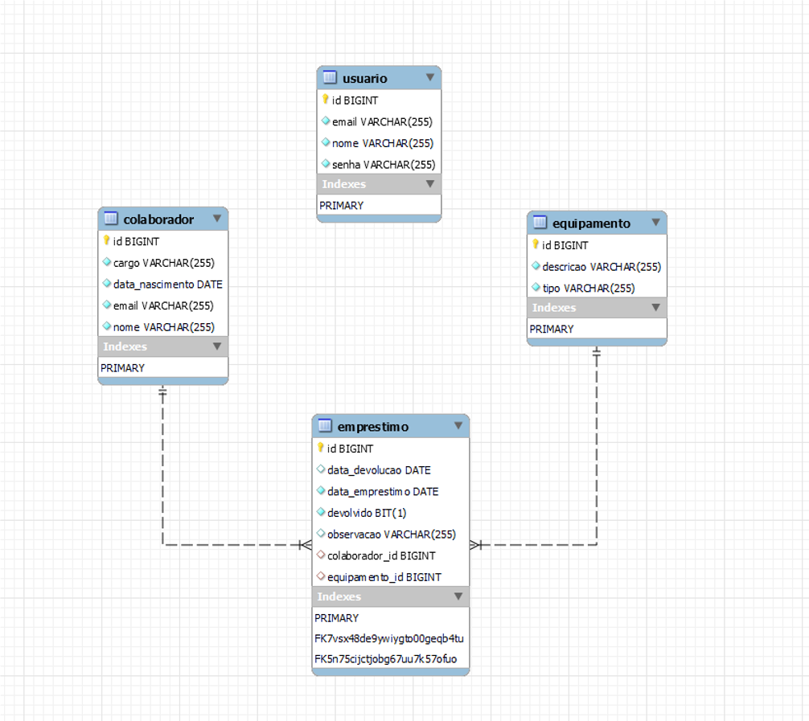
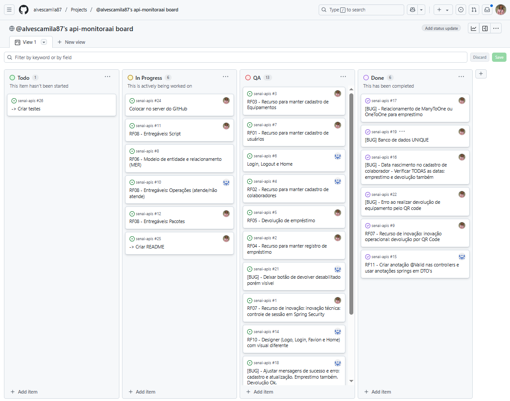

# 🛡️ MonitoraAi Gestão de EPIs — Spring Boot + Thymeleaf

A empresa de construção civil local identificou a necessidade premente de aprimorar a gestão dos **Equipamentos de Proteção Individual (EPIs)** utilizados por seus colaboradores.

Muitos deles não estão utilizando os EPIs devido a esquecimentos, seja por não trazê-los consigo ou por não retirá-los do departamento de Saúde e Segurança do Trabalho.  
A última auditoria interna revelou uma **necessidade crítica de melhoria** na administração do uso dos EPIs.

## 📁 Estrutura de Diretórios

```
src
└── main
    ├── java
    │   └── br.com.empresa
    │       ├── controller
    │       │   ├── colaborador
    │       │   ├── equipamento
    │       │   ├── emprestimo
    │       │   └── usuario
    │       ├── dto
    │       │   ├── colaborador
    │       │   ├── equipamento
    │       │   ├── emprestimo
    │       │   └── usuario
    │       ├── entity
    │       │   ├── colaborador
    │       │   ├── equipamento
    │       │   ├── emprestimo
    │       │   └── usuario
    │       ├── repository
    │       │   ├── colaborador
    │       │   ├── equipamento
    │       │   ├── emprestimo
    │       │   └── usuario
    │       ├── service
    │       │   ├── colaborador
    │       │   ├── equipamento
    │       │   ├── emprestimo
    │       │   └── usuario
    │       └── exception
    └── resources
        ├── static
        ├── templates
        └── application.properties
```

---

## 🗺️ Modelo Entidade-Relacionamento (MER)



## 🛠️ Tecnologias e Ferramentas Utilizadas

- ☕ Java JDK 17+
- 🌱 Spring Boot
- 🔒 Spring Security
- 🧾 Thymeleaf
- 🐬 MariaDB
- 🐿️ Lombok
- 📷 ZXing (QR Code)
- 💻 HTML, CSS e JavaScript
- 📦 GitHub
- 📦 GitHub Projects (Kanban)

## ▶️ Como Executar o Projeto

1. Clone o repositório:

   ```bash
   git clone git@github.com:alvescamila87/api-monitoraai.git
   ```

2. Configure o banco de dados em `src/main/resources/application.properties`:

   ```properties
   spring.datasource.url=jdbc:mariadb://localhost:3306/apimonitoraai
   spring.datasource.username=seu-usuario
   spring.datasource.password=sua-senha
   ```

3. Rode o projeto com sua IDE (Spring Tool Suite, IntelliJ, Eclipse, VS Code, etc.).

4. Acesse no navegador:
   ```
   http://localhost:8080
   ```

## 📡 Endpoints da API

### 🔐 Usuário (`/usuarios`)

- `GET /usuarios` – Listar todos
- `POST /usuarios` – Criar novo
- `PUT /usuarios/{id}` – Atualizar existente
- `DELETE /usuarios/{id}` – Remover

### 👷 Colaborador (`/colaboradores`)

- `GET /colaboradores`
- `POST /colaboradores`
- `PUT /colaboradores/{id}`
- `DELETE /colaboradores/{id}`

### 🦺 Equipamento (`/equipamentos`)

- `GET /equipamentos`
- `POST /equipamentos`
- `PUT /equipamentos/{id}`
- `DELETE /equipamentos/{id}`

### 📦 Empréstimo (`/emprestimos`)

- `GET /emprestimos` – Visualizar
- `POST /emprestimos` – Emprestar equipamento
- `POST /emprestimos/devolucao` – Devolver equipamento
- `POST /emprestimos/devolucao-qrcode` – Devolução via QR Code

## 📋 Kanban do Projeto

> Link para o quadro no GitHub Projects:  
> [🔗 Acessar Kanban](https://github.com/users/alvescamila87/projects/5/views/1)
> 

## 🖼️ Imagens da Aplicação

> Inclua aqui imagens como:

- Tela de login
- Cadastro de equipamentos
- Tela de empréstimos
- Leitura de QR Code

Exemplo:

```markdown


```

## 👥 Autores

- [Camila Alves](https://github.com/alvescamila87)
- [João Emidio](https://github.com/emidiojoao)

## 🤝 Contribuições

Contribuições são bem-vindas!  
Sinta-se à vontade para abrir uma _issue_ ou enviar um _pull request_ 🚀
